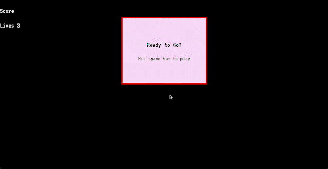
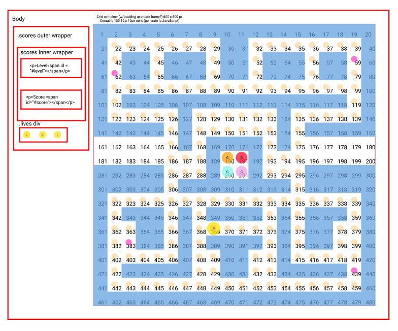

# Ms PacMan
Solo coding project (7 days)

### Technologies used:
* JavaScript (ES6)
* HTML5
* CSS

## Deployment 
This game has been deployed on GitHub pages,  [see it here.](https://hollylouisarose.github.io/sei-project-one/) 

## Overview
The brief for my first General Assembly project was to create a grid based game that is rendered in the browser. I had to design logic for winning the game and visually display when the player has won. I was to use JavaScript for all DOM manipulation. 

I decided to challenge myself and create a Pac-Man game. The player controlsPac-Man through an enclosed maze. The aim of the game is for Pac-Man to eat all of the dots and avoid the four ghosts that give chase. When he has eaten all of the dots, the player advances to the next level. If a ghost catches Pac-Man he loses a life; the game ends when all lives are lost.

I chose Pac-Man because aside from childhood nostalgia, it presented interesting coding challenges:

* A moving Pac-Man character (operated by arrow keys)
* Automated ghosts that move independently around the maze.
* Win and lose states (in particular, when Pac-Man and the ghosts collide)

In my version, I decided on a Ms Pac-Man theme, as I love her colourful 80s aesthetic and sassy nature.

#### Gameplay



## Approach



After some initial research, I worked on one section of the game at a time, testing as I went. My build process was as follows:

* The Maze.
* Moving Ms Pac-Man.
* The Ghosts.

#### The Maze

To translate my maze design onto the screen I used for loops to apply my CSS ‘wall’ class to certain grid squares. Although not the most sophisticated solution, it was great practice in iteration and allowed me to apply the class to large grid areas fairly efficiently.


``` javascript
function makeWalls(){
  if (level === 1){
  // * border walls
    for (let index = 0; index <= 380; index += 20) {
      cells[index].classList.add(wallClass)
    }

    for (let index = 19; index <= 399; index += 20) {
      cells[index].classList.add(wallClass)
    }

    for (let index = 0; index <= 19; index++) {
      cells[index].classList.add(wallClass)  
    }

    for (let index = 381; index <= 398; index++) {
      cells[index].classList.add(wallClass)  
    }
```

#### Moving Ms Pac-Man

To move Ms Pac-Man I used a switch statement, something I hadn’t explored much before. I found it gave me a solid base to build on as I could test different logic each time Ms Pac-Man entered a new grid square. For example, was she in the same square as a super point? If so, add 50 points to the score.

``` javascript
function handleKeyDown(event){
  removePacman()
  gameScore.innerHTML = totalGameScore
  switch (event.keyCode) {
    case 39:
      if (wallCheck(pacmanPosition + 1)){
        pacmanPosition ++ 
        scoreCheck(pacmanPosition)
        superFoodCheck(pacmanPosition)
        ghostCheck(pacmanPosition)

      } 
      break
    case 37: 
      if ( wallCheck(pacmanPosition - 1)){
        pacmanPosition --
        scoreCheck(pacmanPosition)
        superFoodCheck(pacmanPosition)
        ghostCheck(pacmanPosition)
      } 
      break
    case 38:
      if (wallCheck(pacmanPosition - 20)) {
        pacmanPosition -= width
        scoreCheck(pacmanPosition)
        superFoodCheck(pacmanPosition)
        ghostCheck(pacmanPosition)
      }
      break 
    case 40:
      if (wallCheck(pacmanPosition + 20)){
        pacmanPosition += width
        scoreCheck(pacmanPosition)
        superFoodCheck(pacmanPosition)
        ghostCheck(pacmanPosition)
      }
      break
  }
  addPacman()
}
```

## Challenges

The ghosts were undoubtedly the most challenging aspect of the game.

#### The Ghosts

My biggest block was getting the ghosts to move independently and to not move through the walls (ironically).

After much trial and error, I discovered I needed the ghosts to ‘check’ if the grid square in front of them was clear before they moved. If it contained a ‘wall’ class, then they needed to choose a different movement direction.

To achieve this, I wrote two functions, a pathCheck, which checked if the square ahead of Ms Pac-Man contained a ‘wall’ class and returned a Boolean value.

I then wrote a ghostMove function which chose a random movement direction (based on an array of four possible ghost moves across the grid). Before moving, this function calls the path check function, based on the value it returns, the ghost will move, or choose another direction. 

I also used a setTimeout on each ghost's movement function so they moved at different speeds. In keeping with the original game, Blinky the red ghost is the fastest and Clyde the orange ghost is the slowest. 

``` javascript
function redGhostMove(){
  setTimeout(() => {
    let ghostPath = ghostMoves[Math.floor(Math.random() * ghostMoves.length)]
    removeRedGhost()
    setInterval(() => {
      redPathCheck(ghostPath)
      if (isPathClear === false){
        ghostPath = ghostMoves[Math.floor(Math.random() * ghostMoves.length)]
        redPathCheck(ghostPath)
      }
      if (isPathClear === true && ghostPath === 1){
        removeRedGhost()
        redGhostPosition += 1
        addRedGhost()
      } else if (isPathClear === true && ghostPath === -1){
        removeRedGhost()
        redGhostPosition -= 1
        addRedGhost()
      } else if (isPathClear === true && ghostPath === - width){
        removeRedGhost()
        redGhostPosition -= width
        addRedGhost()
      } else if (isPathClear === true && ghostPath === + width){
        removeRedGhost()
        redGhostPosition += width
        addRedGhost()
      } 
    } , 100)
    addRedGhost()
  }, 150)
}

function redPathCheck(ghostPath){
  if (cells[redGhostPosition + ghostPath].classList.contains(wallClass)){
    isPathClear = false
  } else {
    isPathClear = true
  }
}
```
The ghost movement was a fascinating, if at times frustrating process. It taught me a lot about conditional logic, the power of Booleans and calling functions inside of other functions.

To improve my code, I would like to explore writing the ghosts as a class so I could write one ghost function rather than eight separate functions (two per ghost).

#### Known bugs

 The score does not add 10 points on Ms PacMans first move.
 The game starts on a space bar event, but will attempt to start again if the space bar is clicked more than once.
 Game will reload if the user clicks anywhere on the page.
 The ghosts don’t always remove a life from Ms PacMan when their paths cross.

#### Future features 

More levels, with more complicated maze designs.
’Chase’ state (ghosts track Ms Pac-Man’s movement).
‘Scared’ state (Ms Pac-Man gains points from eating the ghosts after eating a super point)

## Key Learnings

Ms Pac-Man greatly helped me improve my JavaScript understanding, especially using Booleans to check certain states and how to call functions inside other functions. I also learnt that you don’t have to stick with code just because you’ve sunk time into it. Even your failures are very valuable. You always learn from the process and then write better code on the next pass.

#### Credits

Sprites pulled from Ms.Pac-Man by JDASTER64,
[GameBoy Advance - Namco Museum - Ms. Pacman - General Sprites - The Spriters Resource](https://www.spriters-resource.com/game_boy_advance/namcomuseum/sheet/22732/)

Music ‘Ready for the Floor’ by Hot Chip

